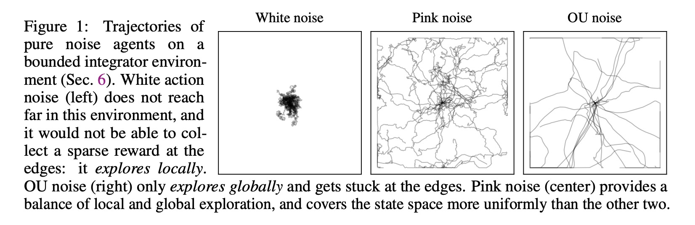

# Pink Noise for Deep RL

inspired by [this paper](https://openreview.net/pdf?id=hQ9V5QN27eS) on pink noise for online RL

`deterministic.py` and `noise_process.py` contains isolated numpy modules of generating noise for deterministic actors and general noise processes respectively. `stochactic.torch` and `stochastic_jax` contain an example implementation of stochastic actor with such type of noise on PyTorch and Jax/Flax respectively.

The implementation is very far from ideal one!

